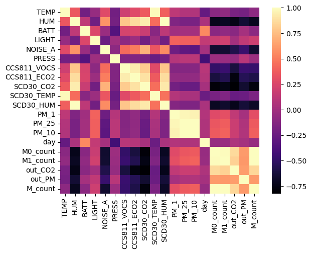
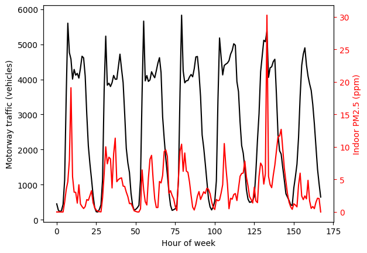
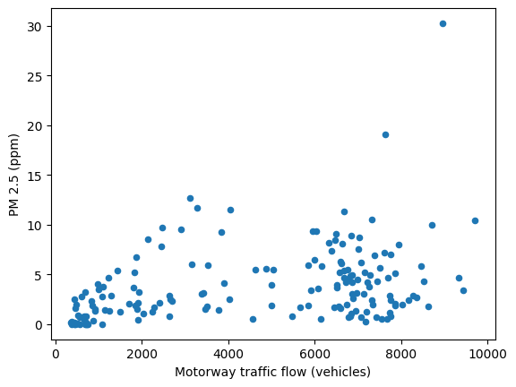
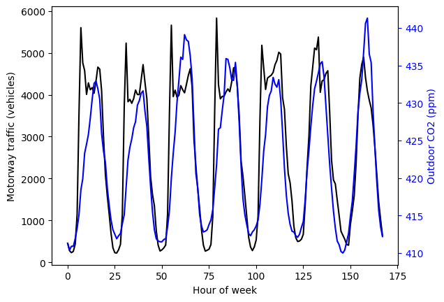
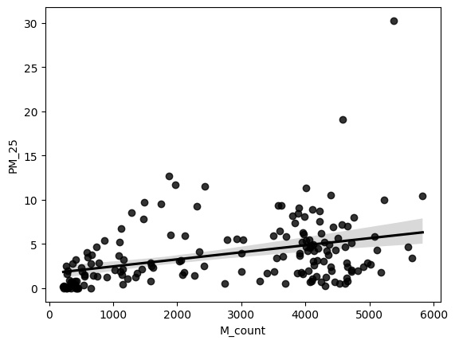
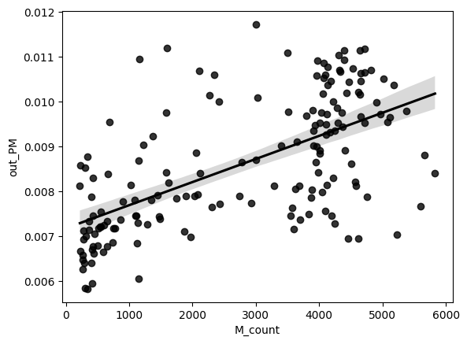
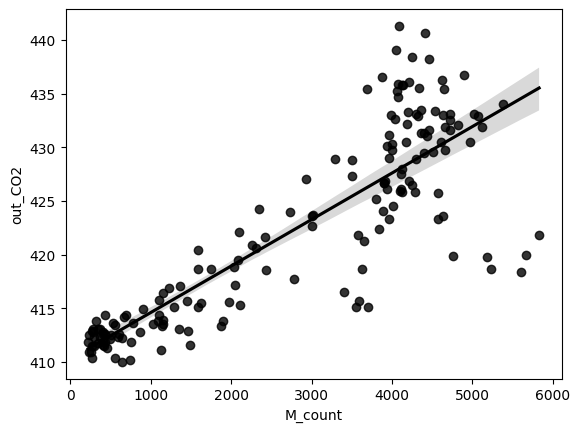
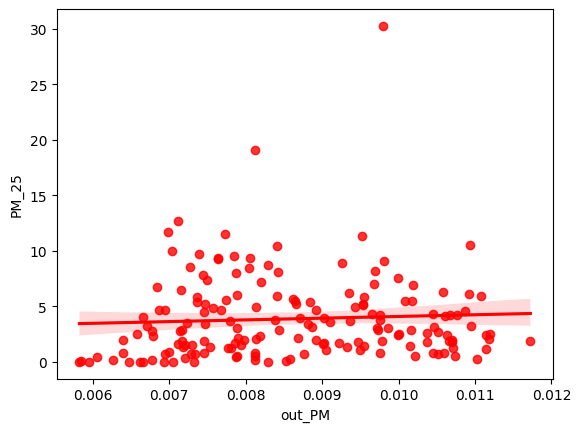
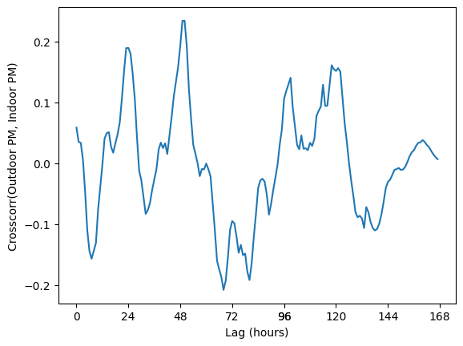
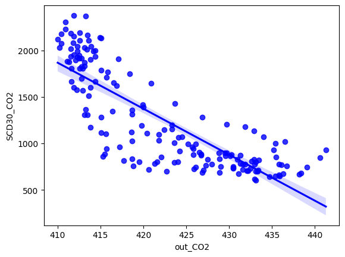

# Air quality vs motorway traffic

Let's look at relationships between air quality and local motorway traffic.

The datasets in ./Data include:
- **indoor air quality data**: these are real and unmasked;
- **traffic data**: these are masked, and show "hour of week" vs traffic flow (data collected over one week at a time similar to indoor air quality monitoring);
- **outdoor air quality**: also masked, and show "hour of week" vs average outdoor CO2 and particulate matter (the averages were taken over a 6 month period that did not overlap with indoor air quality monitoring).

The data masking method used preserves correlations between data sets, but does not preserve absolute magnitudes.


```python
from lib import airqual_read
from lib import plotter
from lib import constants
import pandas as pd
import numpy as np
from matplotlib import pyplot as plt
import statsmodels.api as sm
import seaborn as sns

# Several air quality sensors are placed at location 1b14, pick out sensor 0.
location = "1b14"
sensor = 0
```

The traffic data that we have is 1-hourly aggregated data.

We want indoor air quality data to match this, so we'll downsample it to a 1-hourly average (non-overlapping windows).


```python
# Get the hourly averaged indoor air quality df
df = airqual_read.hourly_airqual(location,sensor)

# Read in the traffic flow data and outdoor air quality for this location and append to indoor air qual dataframe
traffic_df = pd.read_csv(constants.TRAFFIC_PATH / (location + "_traffic.csv"),index_col=0)
outdoor_df = pd.read_csv(constants.AIR_PATH / "outdoor" / (location + "_outair.csv"),index_col=0)

df = pd.concat([df,traffic_df,outdoor_df],axis=1)

# There are two motorways near this location. We'll aggregate the traffic flows.
df["M_count"] = df["M0_count"] + df["M1_count"]
```

At this point, our dataframe is full of various readings of temperature, humidity, noise, CO2, particulate matter, etc.


```python
print(df)
```

              TEMP        HUM       BATT      LIGHT    NOISE_A      PRESS  \
    0    16.264059  78.628954  99.928870   0.000000  35.952594  99.764686   
    1    16.346485  79.248243  99.903766   0.000000  35.865021  99.771841   
    2    16.500750  80.312111  99.925000   0.000000  34.076295  99.404556   
    3    16.421972  80.741444  99.916667   0.000000  34.125278  99.400889   
    4    16.395894  80.813212  99.932961   0.000000  34.196369  99.416229   
    ..         ...        ...        ...        ...        ...        ...   
    163  15.943917  76.093222  99.961111   0.000000  29.808917  99.469083   
    164  15.865487  76.350251  99.944290   0.000000  29.331838  99.461393   
    165  15.912694  77.273917  99.947222  21.419444  31.211778  99.448139   
    166  16.070724  78.309916  99.935933   5.880223  33.647437  99.437437   
    167  16.189038  77.753180  99.907950   0.000000  36.959079  99.749289   
    
         CCS811_VOCS  CCS811_ECO2    SCD30_CO2  SCD30_TEMP  SCD30_HUM      PM_1  \
    0    1327.418410  2039.280335  1875.799163   19.706946  64.995188  0.000000   
    1    1587.753138  2314.234310  2075.673640   19.792176  65.470544  0.000000   
    2    2271.337143  2702.648571  2229.947222   19.848778  66.799417  0.000000   
    3    2456.877778  2804.252778  2304.613889   19.872889  66.909750  0.000000   
    4    2956.011173  3048.840782  2377.586592   19.838687  67.001480  0.000000   
    ..           ...          ...          ...         ...        ...       ...   
    163    88.355556   937.636111   800.188889   19.342583  63.169694  0.000000   
    164    96.651811  1037.629526   800.844011   19.277242  63.381978  0.197183   
    165   195.763889  1318.558333   941.025000   19.337333  64.092278  0.569444   
    166   693.328691  1714.345404  1306.637883   19.508969  64.917967  0.295775   
    167  1184.711297  1879.288703  1575.991632   19.630167  64.366904  0.000000   
    
            PM_25     PM_10  day  M0_count  M1_count  out_CO2    out_PM  M_count  
    0    0.000000  0.000000  0.0     198.0     253.0    411.3  0.007045    451.0  
    1    0.000000  0.000000  0.0     116.0     158.0    410.4  0.006935    274.0  
    2    0.000000  0.069444  0.0     109.0     120.0    410.9  0.006663    229.0  
    3    0.000000  0.027778  0.0     141.0     120.0    410.9  0.006470    261.0  
    4    0.000000  0.000000  0.0     247.0     187.0    411.9  0.006612    434.0  
    ..        ...       ...  ...       ...       ...      ...       ...      ...  
    163  0.513889  0.805556  6.0    1285.0    1450.0    424.0  0.007893   2735.0  
    164  1.478873  2.154930  6.0     980.0    1102.0    419.5  0.007939   2082.0  
    165  2.111111  2.930556  6.0     718.0     728.0    415.7  0.007906   1446.0  
    166  2.056338  3.070423  6.0     503.0     520.0    413.5  0.008137   1023.0  
    167  0.000000  0.000000  6.0     315.0     331.0    412.2  0.007331    646.0  
    
    [168 rows x 20 columns]


We'll approach this naively and try and see which variables correlate strongly with each other. Here is a correlation heatmap:


```python
corr = df.corr()
sns.heatmap(corr, cmap="magma",annot=False)
```


    <AxesSubplot: >


    

    


The heatmap (and the correlation variables below) show that:
- outdoor CO2 (out_CO2) correlates strongly with motorway traffic (=0.85), and correlates well with outdoor PM (=0.6);
- indoor particulate matter (PM_1, P_25, PM_10) show weak correlations (0.4) with motorway traffic;
- of all indoor environmental quality variables, particulate matter has the strongest correlation with motorway traffic.


```python
print(f"=Correlation of variables with traffic count=\n{corr.M_count}")

#print(f"=Correlation of variables with traffic count=\n{corr.PM_25}")
```

    =Correlation of variables with traffic count=
    TEMP          -0.091127
    HUM           -0.720241
    BATT          -0.098234
    LIGHT          0.190017
    NOISE_A       -0.664586
    PRESS         -0.027323
    CCS811_VOCS   -0.479208
    CCS811_ECO2   -0.587075
    SCD30_CO2     -0.775458
    SCD30_TEMP    -0.166123
    SCD30_HUM     -0.690713
    PM_1           0.295394
    PM_25          0.360571
    PM_10          0.380991
    day           -0.048439
    M0_count       0.996021
    M1_count       0.997297
    out_CO2        0.846241
    out_PM         0.614644
    M_count        1.000000
    Name: M_count, dtype: float64


Let's plot some time series. We'll always plot motorway traffic over the week in black, and we'll overlay:
- indoor PM 2.5 (red);
- outdoor PM (green);
- outdoor CO2 (blue).


```python
plotter.overlay_plot(df,"M_count","Motorway traffic (vehicles)","PM_25","Indoor PM2.5 (ppm)",['k','r'])
plotter.overlay_plot(df,"M_count","Motorway traffic (vehicles)","out_PM","Outdoor PM (ppm)",['k','g'])
plotter.overlay_plot(df,"M_count","Motorway traffic (vehicles)","out_CO2","Outdoor CO2 (ppm)",['k','b'])
```


    

    


    

    


    

    


These show correlations, but scatter plots might do it better. If we scatter indoor PM 2.5 vs traffic, we see the weak correlation.


```python
sns.regplot(df,x="M_count",y="PM_25",color="black")
```


    <AxesSubplot: xlabel='M_count', ylabel='PM_25'>


    

    


Outdoor PM vs traffic, and outdoor CO2 vs traffic show much stronger correlations.


```python
sns.regplot(df,x="M_count",y="out_PM",color="black")
```


    <AxesSubplot: xlabel='M_count', ylabel='out_PM'>


    

    


```python
sns.regplot(df,x="M_count",y="out_CO2",color="black")
```


    <AxesSubplot: xlabel='M_count', ylabel='out_CO2'>


    

    


Indoor PM 2.5 vs outdoor PM: here we have very weak / no correlation. 


```python
sns.regplot(df,x="out_PM",y="PM_25",color="red")
```


    <AxesSubplot: xlabel='out_PM', ylabel='PM_25'>


    

    


Could it be that outdoor and indoor PM are just out of phase (e.g. it takes time for particulate matter to move indoors)?

We can check this by cross-correlating the outdoor and indoor PM values with different amounts of lag applied to one time series.


```python
corr_df = pd.Series(sm.tsa.ccf(df["PM_25"],df["out_PM"],adjusted=False))
fig,ax = plt.subplots()
corr_df.plot()
plt.xticks([0,24,48,48+24,48+48,72+24,72+48,72+72,144+24])
ax.set_xlabel("Lag (hours)")
ax.set_ylabel("Crosscorr(Outdoor PM, Indoor PM)")
```


    Text(0, 0.5, 'Crosscorr(Outdoor PM, Indoor PM)')


    

    


The plot is daily cyclic, showing maximum correlation values of 0.2. There might be some link here. Getting outdoor air quality data over the same period as indoor air quality data could help in future work.

Some final things that are just interesting. Indoor CO2 vs outdoor CO2 shows a strong negative correlation. The reason for this could be because people tend to stay indoors at night when traffic is low.


```python
sns.regplot(df,x="out_CO2",y="SCD30_CO2",color="blue")
```


    <AxesSubplot: xlabel='out_CO2', ylabel='SCD30_CO2'>


    

    


As the indoor air quality is unmasked, we can use it to calculate the average absolute indoor PM 2.5 levels and compare them against WHO guidelines.

Looks like this location could do with an HEPA filter.


```python
meanval = df["PM_25"].mean() * 1000
print(f"Average PM 2.5 is {np.rint(meanval)} ug/m3. WHO guidelines say aim for annual average of 5 ug/m3")
```

    Average PM 2.5 is 3879.0 ug/m3. WHO guidelines say aim for annual average of 5 ug/m3

