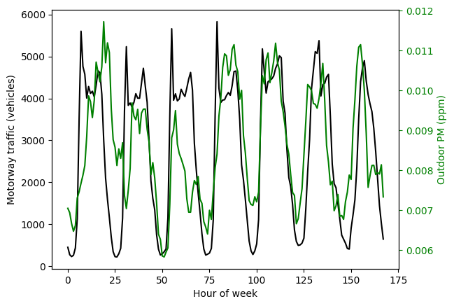

Let's look at relationship between PM2.5 and traffic flow. The data are real, but the location "1b14" is undisclosed.


```python
from lib import airqual_read
from lib import constants
import pandas as pd
import numpy as np
from matplotlib import pyplot as plt

location = "1b14"
```

The traffic data that we have is 1-hourly aggregated data.

We'll read in the air quality data, and then downsample so that it is also 1-hourly average (non-overlapping window).


```python
# Several air quality sensors are placed at this location.
# We retrieve a list of dataframes.
df_list = airqual_read.hourly_airqual(location)

# Let's pick out the second sensor at this location
df = df_list[1]

# Read in the traffic flow data for this location and append to air qual dataframe
traffic_df = pd.read_csv(constants.TRAFFIC_PATH / (location + "_traffic.csv"),index_col=0)
df = pd.concat([df,traffic_df],axis=1)

# There are two motorways near this location. We'll aggregate the traffic flows.
df["M_count"] = df["M0_count"] + df["M1_count"]
```

At this point, our dataframe is full of various readings of temperature, humidity, noise, CO2, particulate matter, etc.


```python
print(df)
```

              TEMP        HUM       BATT      LIGHT    NOISE_A      PRESS  \
    0    16.264059  78.628954  99.928870   0.000000  35.952594  99.764686   
    1    16.346485  79.248243  99.903766   0.000000  35.865021  99.771841   
    2    16.500750  80.312111  99.925000   0.000000  34.076295  99.404556   
    3    16.421972  80.741444  99.916667   0.000000  34.125278  99.400889   
    4    16.395894  80.813212  99.932961   0.000000  34.196369  99.416229   
    ..         ...        ...        ...        ...        ...        ...   
    163  15.943917  76.093222  99.961111   0.000000  29.808917  99.469083   
    164  15.865487  76.350251  99.944290   0.000000  29.331838  99.461393   
    165  15.912694  77.273917  99.947222  21.419444  31.211778  99.448139   
    166  16.070724  78.309916  99.935933   5.880223  33.647437  99.437437   
    167  16.189038  77.753180  99.907950   0.000000  36.959079  99.749289   
    
         CCS811_VOCS  CCS811_ECO2    SCD30_CO2  SCD30_TEMP  SCD30_HUM      PM_1  \
    0    1327.418410  2039.280335  1875.799163   19.706946  64.995188  0.000000   
    1    1587.753138  2314.234310  2075.673640   19.792176  65.470544  0.000000   
    2    2271.337143  2702.648571  2229.947222   19.848778  66.799417  0.000000   
    3    2456.877778  2804.252778  2304.613889   19.872889  66.909750  0.000000   
    4    2956.011173  3048.840782  2377.586592   19.838687  67.001480  0.000000   
    ..           ...          ...          ...         ...        ...       ...   
    163    88.355556   937.636111   800.188889   19.342583  63.169694  0.000000   
    164    96.651811  1037.629526   800.844011   19.277242  63.381978  0.197183   
    165   195.763889  1318.558333   941.025000   19.337333  64.092278  0.569444   
    166   693.328691  1714.345404  1306.637883   19.508969  64.917967  0.295775   
    167  1184.711297  1879.288703  1575.991632   19.630167  64.366904  0.000000   
    
            PM_25     PM_10  day  M0_count  M1_count  M_count  
    0    0.000000  0.000000  0.0       330       422      752  
    1    0.000000  0.000000  0.0       193       263      456  
    2    0.000000  0.069444  0.0       182       200      382  
    3    0.000000  0.027778  0.0       235       200      435  
    4    0.000000  0.000000  0.0       411       312      723  
    ..        ...       ...  ...       ...       ...      ...  
    163  0.513889  0.805556  6.0      2141      2416     4557  
    164  1.478873  2.154930  6.0      1634      1837     3471  
    165  2.111111  2.930556  6.0      1196      1214     2410  
    166  2.056338  3.070423  6.0       839       866     1705  
    167  0.000000  0.000000  6.0       525       551     1076  
    
    [168 rows x 18 columns]


We'll approach this naively and try and see which variables correlate strongly with each other. Doing this shows that PM_25 (PM 2.5) has a weak/moderate correlation of about 0.4 with total motorway traffic flow.


```python
print(df.corr())
```


<div>
<style scoped>
    .dataframe tbody tr th:only-of-type {
        vertical-align: middle;
    }

    .dataframe tbody tr th {
        vertical-align: top;
    }

    .dataframe thead th {
        text-align: right;
    }
</style>
<table border="1" class="dataframe">
  <thead>
    <tr style="text-align: right;">
      <th></th>
      <th>TEMP</th>
      <th>HUM</th>
      <th>BATT</th>
      <th>LIGHT</th>
      <th>NOISE_A</th>
      <th>PRESS</th>
      <th>CCS811_VOCS</th>
      <th>CCS811_ECO2</th>
      <th>SCD30_CO2</th>
      <th>SCD30_TEMP</th>
      <th>SCD30_HUM</th>
      <th>PM_1</th>
      <th>PM_25</th>
      <th>PM_10</th>
      <th>day</th>
      <th>M0_count</th>
      <th>M1_count</th>
      <th>M_count</th>
    </tr>
  </thead>
  <tbody>
    <tr>
      <th>TEMP</th>
      <td>1.000000</td>
      <td>0.348004</td>
      <td>-0.215066</td>
      <td>-0.048114</td>
      <td>0.277731</td>
      <td>-0.216997</td>
      <td>0.192807</td>
      <td>0.274876</td>
      <td>0.361620</td>
      <td>0.982783</td>
      <td>0.380277</td>
      <td>0.117268</td>
      <td>0.073169</td>
      <td>0.062629</td>
      <td>-0.271903</td>
      <td>-0.109794</td>
      <td>-0.075218</td>
      <td>-0.091142</td>
    </tr>
    <tr>
      <th>HUM</th>
      <td>0.348004</td>
      <td>1.000000</td>
      <td>0.127964</td>
      <td>-0.219791</td>
      <td>0.590367</td>
      <td>-0.200685</td>
      <td>0.784337</td>
      <td>0.865434</td>
      <td>0.931950</td>
      <td>0.438683</td>
      <td>0.996366</td>
      <td>-0.149658</td>
      <td>-0.176525</td>
      <td>-0.175673</td>
      <td>0.042550</td>
      <td>-0.735108</td>
      <td>-0.703678</td>
      <td>-0.720243</td>
    </tr>
    <tr>
      <th>BATT</th>
      <td>-0.215066</td>
      <td>0.127964</td>
      <td>1.000000</td>
      <td>0.259032</td>
      <td>-0.035350</td>
      <td>-0.352320</td>
      <td>0.227877</td>
      <td>0.241680</td>
      <td>0.173005</td>
      <td>-0.116293</td>
      <td>0.118250</td>
      <td>-0.006917</td>
      <td>0.006553</td>
      <td>0.005445</td>
      <td>0.546151</td>
      <td>-0.116389</td>
      <td>-0.082649</td>
      <td>-0.098218</td>
    </tr>
    <tr>
      <th>LIGHT</th>
      <td>-0.048114</td>
      <td>-0.219791</td>
      <td>0.259032</td>
      <td>1.000000</td>
      <td>-0.242790</td>
      <td>-0.016363</td>
      <td>-0.095234</td>
      <td>-0.032832</td>
      <td>-0.217748</td>
      <td>-0.032856</td>
      <td>-0.213316</td>
      <td>0.399301</td>
      <td>0.382452</td>
      <td>0.381544</td>
      <td>0.143201</td>
      <td>0.172480</td>
      <td>0.203348</td>
      <td>0.190021</td>
    </tr>
    <tr>
      <th>NOISE_A</th>
      <td>0.277731</td>
      <td>0.590367</td>
      <td>-0.035350</td>
      <td>-0.242790</td>
      <td>1.000000</td>
      <td>-0.094918</td>
      <td>0.436473</td>
      <td>0.501627</td>
      <td>0.705279</td>
      <td>0.344176</td>
      <td>0.559487</td>
      <td>-0.225660</td>
      <td>-0.297031</td>
      <td>-0.311816</td>
      <td>0.013444</td>
      <td>-0.666472</td>
      <td>-0.659078</td>
      <td>-0.664599</td>
    </tr>
    <tr>
      <th>PRESS</th>
      <td>-0.216997</td>
      <td>-0.200685</td>
      <td>-0.352320</td>
      <td>-0.016363</td>
      <td>-0.094918</td>
      <td>1.000000</td>
      <td>-0.141142</td>
      <td>-0.144661</td>
      <td>-0.183571</td>
      <td>-0.254121</td>
      <td>-0.202180</td>
      <td>0.086579</td>
      <td>0.104803</td>
      <td>0.107635</td>
      <td>-0.429404</td>
      <td>-0.020202</td>
      <td>-0.032995</td>
      <td>-0.027303</td>
    </tr>
    <tr>
      <th>CCS811_VOCS</th>
      <td>0.192807</td>
      <td>0.784337</td>
      <td>0.227877</td>
      <td>-0.095234</td>
      <td>0.436473</td>
      <td>-0.141142</td>
      <td>1.000000</td>
      <td>0.935007</td>
      <td>0.805563</td>
      <td>0.277245</td>
      <td>0.780386</td>
      <td>-0.126319</td>
      <td>-0.132555</td>
      <td>-0.123778</td>
      <td>0.099615</td>
      <td>-0.494551</td>
      <td>-0.463696</td>
      <td>-0.479210</td>
    </tr>
    <tr>
      <th>CCS811_ECO2</th>
      <td>0.274876</td>
      <td>0.865434</td>
      <td>0.241680</td>
      <td>-0.032832</td>
      <td>0.501627</td>
      <td>-0.144661</td>
      <td>0.935007</td>
      <td>1.000000</td>
      <td>0.890838</td>
      <td>0.364789</td>
      <td>0.865041</td>
      <td>-0.072257</td>
      <td>-0.079218</td>
      <td>-0.071717</td>
      <td>0.075909</td>
      <td>-0.609968</td>
      <td>-0.564689</td>
      <td>-0.587075</td>
    </tr>
    <tr>
      <th>SCD30_CO2</th>
      <td>0.361620</td>
      <td>0.931950</td>
      <td>0.173005</td>
      <td>-0.217748</td>
      <td>0.705279</td>
      <td>-0.183571</td>
      <td>0.805563</td>
      <td>0.890838</td>
      <td>1.000000</td>
      <td>0.450857</td>
      <td>0.921047</td>
      <td>-0.207647</td>
      <td>-0.252529</td>
      <td>-0.258611</td>
      <td>0.019399</td>
      <td>-0.791315</td>
      <td>-0.757746</td>
      <td>-0.775459</td>
    </tr>
    <tr>
      <th>SCD30_TEMP</th>
      <td>0.982783</td>
      <td>0.438683</td>
      <td>-0.116293</td>
      <td>-0.032856</td>
      <td>0.344176</td>
      <td>-0.254121</td>
      <td>0.277245</td>
      <td>0.364789</td>
      <td>0.450857</td>
      <td>1.000000</td>
      <td>0.464199</td>
      <td>0.075309</td>
      <td>0.036651</td>
      <td>0.027745</td>
      <td>-0.242700</td>
      <td>-0.187658</td>
      <td>-0.147397</td>
      <td>-0.166136</td>
    </tr>
    <tr>
      <th>SCD30_HUM</th>
      <td>0.380277</td>
      <td>0.996366</td>
      <td>0.118250</td>
      <td>-0.213316</td>
      <td>0.559487</td>
      <td>-0.202180</td>
      <td>0.780386</td>
      <td>0.865041</td>
      <td>0.921047</td>
      <td>0.464199</td>
      <td>1.000000</td>
      <td>-0.132487</td>
      <td>-0.155959</td>
      <td>-0.154088</td>
      <td>0.032091</td>
      <td>-0.706477</td>
      <td>-0.673590</td>
      <td>-0.690716</td>
    </tr>
    <tr>
      <th>PM_1</th>
      <td>0.117268</td>
      <td>-0.149658</td>
      <td>-0.006917</td>
      <td>0.399301</td>
      <td>-0.225660</td>
      <td>0.086579</td>
      <td>-0.126319</td>
      <td>-0.072257</td>
      <td>-0.207647</td>
      <td>0.075309</td>
      <td>-0.132487</td>
      <td>1.000000</td>
      <td>0.971183</td>
      <td>0.956436</td>
      <td>0.067334</td>
      <td>0.277480</td>
      <td>0.308432</td>
      <td>0.295414</td>
    </tr>
    <tr>
      <th>PM_25</th>
      <td>0.073169</td>
      <td>-0.176525</td>
      <td>0.006553</td>
      <td>0.382452</td>
      <td>-0.297031</td>
      <td>0.104803</td>
      <td>-0.132555</td>
      <td>-0.079218</td>
      <td>-0.252529</td>
      <td>0.036651</td>
      <td>-0.155959</td>
      <td>0.971183</td>
      <td>1.000000</td>
      <td>0.996743</td>
      <td>0.055430</td>
      <td>0.340430</td>
      <td>0.375051</td>
      <td>0.360588</td>
    </tr>
    <tr>
      <th>PM_10</th>
      <td>0.062629</td>
      <td>-0.175673</td>
      <td>0.005445</td>
      <td>0.381544</td>
      <td>-0.311816</td>
      <td>0.107635</td>
      <td>-0.123778</td>
      <td>-0.071717</td>
      <td>-0.258611</td>
      <td>0.027745</td>
      <td>-0.154088</td>
      <td>0.956436</td>
      <td>0.996743</td>
      <td>1.000000</td>
      <td>0.053782</td>
      <td>0.359778</td>
      <td>0.396230</td>
      <td>0.381006</td>
    </tr>
    <tr>
      <th>day</th>
      <td>-0.271903</td>
      <td>0.042550</td>
      <td>0.546151</td>
      <td>0.143201</td>
      <td>0.013444</td>
      <td>-0.429404</td>
      <td>0.099615</td>
      <td>0.075909</td>
      <td>0.019399</td>
      <td>-0.242700</td>
      <td>0.032091</td>
      <td>0.067334</td>
      <td>0.055430</td>
      <td>0.053782</td>
      <td>1.000000</td>
      <td>-0.051734</td>
      <td>-0.045458</td>
      <td>-0.048453</td>
    </tr>
    <tr>
      <th>M0_count</th>
      <td>-0.109794</td>
      <td>-0.735108</td>
      <td>-0.116389</td>
      <td>0.172480</td>
      <td>-0.666472</td>
      <td>-0.020202</td>
      <td>-0.494551</td>
      <td>-0.609968</td>
      <td>-0.791315</td>
      <td>-0.187658</td>
      <td>-0.706477</td>
      <td>0.277480</td>
      <td>0.340430</td>
      <td>0.359778</td>
      <td>-0.051734</td>
      <td>1.000000</td>
      <td>0.986784</td>
      <td>0.996022</td>
    </tr>
    <tr>
      <th>M1_count</th>
      <td>-0.075218</td>
      <td>-0.703678</td>
      <td>-0.082649</td>
      <td>0.203348</td>
      <td>-0.659078</td>
      <td>-0.032995</td>
      <td>-0.463696</td>
      <td>-0.564689</td>
      <td>-0.757746</td>
      <td>-0.147397</td>
      <td>-0.673590</td>
      <td>0.308432</td>
      <td>0.375051</td>
      <td>0.396230</td>
      <td>-0.045458</td>
      <td>0.986784</td>
      <td>1.000000</td>
      <td>0.997298</td>
    </tr>
    <tr>
      <th>M_count</th>
      <td>-0.091142</td>
      <td>-0.720243</td>
      <td>-0.098218</td>
      <td>0.190021</td>
      <td>-0.664599</td>
      <td>-0.027303</td>
      <td>-0.479210</td>
      <td>-0.587075</td>
      <td>-0.775459</td>
      <td>-0.166136</td>
      <td>-0.690716</td>
      <td>0.295414</td>
      <td>0.360588</td>
      <td>0.381006</td>
      <td>-0.048453</td>
      <td>0.996022</td>
      <td>0.997298</td>
      <td>1.000000</td>
    </tr>
  </tbody>
</table>
</div>


Plot the time series on the same graph:


```python
# Let's plot the time series
fig,ax = plt.subplots()
df.plot(y="M_count",ax=ax,style="k-")
ax.set_xlabel("Hour of week")
ax.set_ylabel("Motorway traffic flow (vehicles)")
ax1=ax.twinx()
df.plot(y="PM_25",ax=ax1, style="r-")
ax1.set_ylabel("PM 2.5 (ppm)")
ax1.yaxis.label.set_color("red")
ax1.tick_params(axis='y',colors="red")
ax.legend().remove()
ax1.legend().remove()
```


    

    


And scatter PM 2.5 against motorway traffic flow:


```python
df.plot.scatter(x="M_count",y="PM_25", ylabel="PM 2.5 (ppm)",xlabel="Motorway traffic flow (vehicles)")
```


    <AxesSubplot: xlabel='Motorway traffic flow (vehicles)', ylabel='PM 2.5 (ppm)'>


    

    


Finally, calculate the average PM 2.5 levels and compare them against WHO guidelines.


```python
meanval = df["PM_25"].mean() * 1000
print(f"Average PM 2.5 is {np.rint(meanval)} ug/m3. WHO guidelines say aim for annual average of 5 ug/m3")
```

    Average PM 2.5 is 3879.0 ug/m3. WHO guidelines say aim for average of 5 ug/m3

